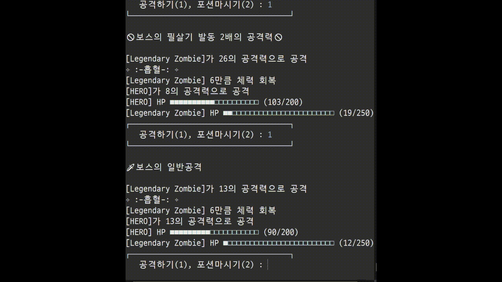

# 다형성 좀비 콘솔 게임

> 게임 소개

**[★HERO]가 보스를 포함한 네마리의 좀비를 무찌르는 게임.**
 
 
> 게임 설명
#### 좀비의 탑
20층 높이의 좀비의 탑에 갇힌 [★HERO] 
탑을 탈출하기 위한 여정이 시작된다.
 
 

#### 좀비
- 초급(Beginner)좀비, 중급(Intermediate)좀비, 고급(Advanced)좀비, 전설적(Legendary)좀비
  - 중급(Intermediate)좀비, 고급(Advanced)좀비
    - 공격시 공격력의 일부를 Hp로 회복하는 능력을 보유.
    - 빠른 속도로 ***뒷통수 가격***을 하기도 한다. (피할 수 없는 공격으로 방패로도 방어불가)
- 전설적(Legendary)좀비
  - 강한 공격력과 높은 체력, 그리고 ***실드***를 갖고 있다.
  - 2배의 공격력을 보여주는 ***필살기***를 사용한다.
 

#### [★HERO]
- Hp를 100 회복시켜주는 ***물약***을 1개 보유하고 있다.
  -  탑을 내려갈 때마다 14% 확률로 1개씩 획득
- 실드를 보유할 수 있다.
  - 탑을 내려갈 때마다 10% 확률로 +50 획득
- [★HERO]가 죽거나 모든 좀비를 물리치면 게임이 끝난다. 

 
 

> Class Diagram (UML)

 
 
> Demo

> GAME CLEAR VERSION

