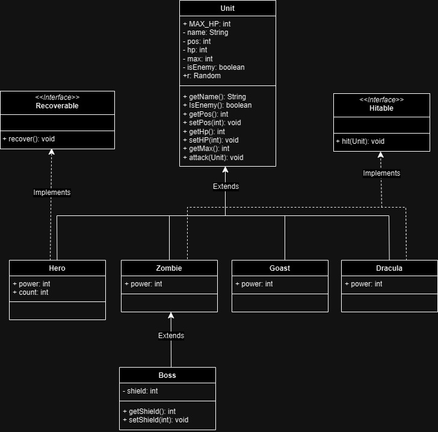

# 다형성 좀비 콘솔 게임

> 게임 소개

**[★히어로]가 보스를 포함한 네마리의 몬스터를 무찌르는 게임.**
 
 
> 게임 설명
#### 몬스터
- Goast, Zombie, Dracula
  - Goast < Zombie < Dracula 순으로 강하다. 
  - 공격시 공격력의 일부를 Hp로 회복하는 능력을 보유하고 있다.
  - 추가적으로 Zombie와 Dracula는 빠른 속도로 ***기습 공격***을 하기도 한다. (피할 수 없는 공격)
- Boss 
  - 강한 공격력과 높은 체력, 그리고 ***실드***를 갖고 있다.
  - 2배의 공격력을 보여주는 ***필살기***를 사용한다.

#### 히어로
- Hp를 100 회복시켜주는 ***물약***을 보유하고 있다. 
- 죽거나 모든 몬스터를 물리치면 게임이 끝난다. 
 
 
> Class Diagram (UML)

 
 
> Demo

